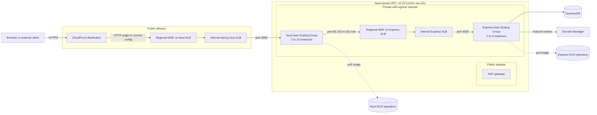
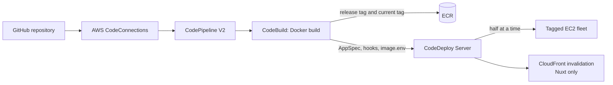

# AWS Infrastructure and Deployment Interview Guide

This document explains the infrastructure that is implemented in this repository. It is intentionally tied to the code rather than describing an imaginary production system. Use it to explain what exists, why each choice was made, where the trust boundaries are, and what you would improve next.

> Nothing in this guide deploys infrastructure. CDK synthesis and diff are read-only planning operations; deployment remains a separate, explicitly authorized action.

## 1. The answer in 60 seconds

The application uses AWS CDK to define independent infrastructure stacks for networking, container repositories, compute, data, CDN, firewall, and application delivery pipelines.

The public path is:

```text
Internet
  -> CloudFront
  -> public Nuxt Application Load Balancer + regional WAF
  -> auto-scaled Nuxt EC2 instances in private subnets
  -> internal Express Application Load Balancer + regional WAF
  -> auto-scaled Express EC2 instances in private subnets
  -> DynamoDB
```

Nuxt owns the shared two-AZ VPC. Express imports that VPC's private-subnet attributes through CloudFormation exports. The Nuxt ALB is public, but both EC2 fleets are private. The Express ALB is internal and its listener is reachable only from the Nuxt Auto Scaling Group's security group. This gives the browser one public entry point while keeping the API off the public internet.

Each application has its own delivery pipeline. A Git push is received through AWS CodeConnections, CodeBuild creates a Docker image, the image is stored in ECR, and CodeDeploy rolls it out to tagged EC2 instances. The deployment strategy updates half of the instances at a time and rolls back failed or stopped deployments. Nuxt additionally invalidates CloudFront after deployment.

DynamoDB uses on-demand billing, a composite primary key, a GSI, point-in-time recovery, deletion protection, retention on stack deletion, and native TTL. The API keeps its human-readable UTC `expiresAt` string and writes a separate numeric `ttl` value in epoch seconds because DynamoDB TTL requires a number.

## 2. Architecture at a glance



The deployment path is separate from the request path:



## Part I — Native AWS notes

This part describes the AWS services independently of this repository. The next part maps those concepts to the exact choices made here. That distinction matters in interviews: first explain what AWS guarantees, then explain the configuration and tradeoffs you chose.

### AWS global infrastructure

An AWS **Region** is a separate geographic area. Most resources in this architecture—including VPCs, ALBs, EC2 instances, DynamoDB tables, ECR repositories, and regional WAF Web ACLs—are created in one Region.

An **Availability Zone** is an isolated location within a Region. AZs have independent power, cooling, and networking failure domains but fast regional links between them. Distributing application capacity across AZs protects against a single-AZ failure; it does not protect against a complete regional failure.

Some AWS services are global or have global behavior. CloudFront uses a global edge network, while its origins and much of its control-plane configuration still interact with regional resources. IAM is account-global even though temporary credentials are used against regional services.

High availability and disaster recovery are different:

- **High availability** keeps a service running through local component or AZ failures.
- **Disaster recovery** restores or shifts service after larger failures, potentially across Regions or accounts.
- A two-AZ deployment is highly available within one Region, not multi-region disaster recovery.

### AWS CDK and CloudFormation

AWS CDK is an infrastructure definition framework. A CDK **construct** is a programming abstraction that represents one or more resources. A CDK **stack** becomes one CloudFormation stack. A CDK **app** composes one or more stacks.

The important lifecycle is:

```text
TypeScript CDK code
  -> CDK synthesis
  -> CloudFormation template
  -> CloudFormation change set/update
  -> AWS resources
```

AWS CDK construct levels are commonly described as:

- **L1 constructs** map almost directly to CloudFormation resources and use names such as `CfnWebACL`.
- **L2 constructs** provide intent-oriented defaults and helper methods, such as `Vpc`, `Table`, or `ApplicationLoadBalancer`.
- **L3 patterns** combine several resources into an opinionated architecture.

CloudFormation uses logical IDs to associate template resources with deployed physical resources. A property update can be:

- no interruption;
- an in-place update with some interruption;
- a resource replacement.

That behavior is resource/property specific. `cdk diff` should be reviewed before deployment, particularly for stateful resources and renamed constructs.

CloudFormation outputs expose useful values. **Cross-stack references** let one stack consume another's resource attributes. Explicit `Export`/`Fn::ImportValue` references can cross independently synthesized stack boundaries, but they also create an ordering relationship and prevent removal of an export that still has consumers.

AWS CDK bootstrapping creates regional/account resources used by deployments, such as an assets bucket and deployment roles. Bootstrapping is an environment prerequisite; it is not an application release.

### Amazon VPC

A VPC is a logically isolated regional network. Its CIDR defines the available private address range. Subnets divide that address space and each subnet belongs to exactly one AZ.

AWS does not mark a subnet public or private with a boolean. Its route table and resource addressing determine behavior:

- A public subnet normally has `0.0.0.0/0` routed to an internet gateway.
- A private subnet has no direct route to an internet gateway.
- A private-with-egress subnet normally routes outbound IPv4 traffic through a NAT gateway in a public subnet.
- An isolated subnet has no general internet route.

An **internet gateway** is a horizontally scaled VPC component for internet communication. A **NAT gateway** permits instances without public IPv4 addresses to initiate outbound connections while blocking unsolicited inbound connections through that path.

NAT gateways are zonal. Cross-AZ use adds a dependency on the NAT's AZ and can add inter-AZ data charges. One NAT per AZ with AZ-local routes improves resilience at higher fixed cost.

Route tables decide where packets can travel. Network ACLs are stateless subnet-level rules. Security groups are stateful elastic-network-interface-level rules. Most application access control should use narrowly scoped security groups; NACLs are an additional coarse subnet boundary.

VPC endpoints let private resources reach supported AWS services without traversing a NAT or public internet path:

- gateway endpoints are available for services such as S3 and DynamoDB;
- interface endpoints use PrivateLink network interfaces for services such as ECR API, Secrets Manager, SSM, and CloudWatch.

Endpoints can improve private connectivity and reduce NAT data processing, but interface endpoints have hourly and data charges. Cost and traffic volume should drive the decision.

### Amazon EC2

EC2 provides virtual machines. An AMI supplies the operating-system image, an instance type supplies CPU/memory/network characteristics, user data bootstraps an instance, and an IAM instance profile supplies temporary AWS credentials.

Key operational responsibilities remain with the owner:

- OS and package patching;
- AMI refreshes;
- disk and filesystem management;
- process supervision;
- capacity and scaling policy;
- application deployment and rollback;
- logs, metrics, and incident response.

That is the central tradeoff versus ECS/Fargate or Lambda: EC2 gives more host control but requires more host operations.

### EC2 Auto Scaling

An Auto Scaling Group maintains a desired number of instances between minimum and maximum capacity. It launches from a launch template, replaces unhealthy instances, spans configured subnets/AZs, and can change desired capacity through scaling policies.

Common scaling approaches are:

- **target tracking** — keep a metric near a target;
- **step scaling** — add/remove different capacity amounts at alarm thresholds;
- **scheduled scaling** — change capacity for known time windows;
- **predictive scaling** — forecast recurring demand.

Scaling has a reaction delay. Instance boot time, application warm-up, health-check thresholds, and metric periods all influence how quickly new capacity serves traffic. Minimum capacity handles expected baseline traffic while scaling catches up.

An ASG is not a deployment system by itself. Instance refresh, CodeDeploy, ECS, or another orchestrator is needed to coordinate application version changes safely.

### Elastic Load Balancing and ALB

An Application Load Balancer operates at layer 7 for HTTP/HTTPS. Its major pieces are:

- **load balancer** — public or internal endpoint distributed across subnets/AZs;
- **listener** — receives a protocol and port, optionally terminates TLS;
- **listener rules** — route by host, path, headers, query strings, source IP, or priority;
- **target group** — registered backends, forwarding settings, and health checks.

An internet-facing ALB has publicly resolvable addresses and routes through public subnets. An internal ALB has private addresses. Neither setting replaces security-group rules.

ALB health checks decide whether a target receives traffic. They should test readiness, not merely whether a process exists. A dependency-heavy health endpoint can cause an entire fleet to be removed during a downstream outage, so liveness and readiness semantics must be chosen carefully.

During deregistration, connection draining allows in-flight requests to finish for a configured delay. Applications should also handle termination signals and stop accepting new work before shutdown.

### Amazon ECR

ECR stores private OCI/Docker images. Repositories, image manifests, tags, and immutable digests are distinct concepts:

- an image digest identifies exact content;
- a tag is a human-readable pointer to a digest;
- a mutable tag can move;
- an immutable tag cannot be overwritten.

Lifecycle policies remove old images according to rules. Scanning reports known vulnerabilities; it does not guarantee exploitability analysis or application correctness. Image signing and pipeline admission policies are separate controls.

IAM controls pull/push actions. EC2, ECS, and CodeBuild normally use roles and short-lived credentials rather than static registry passwords.

### Amazon CloudFront

CloudFront is a content delivery network and reverse proxy. A distribution has one or more origins and cache behaviors. The behavior chooses an origin, allowed methods, viewer protocol policy, cache policy, and origin request policy.

Three concepts are easy to confuse:

- **Cache policy** controls the cache key and cache TTL behavior.
- **Origin request policy** controls what CloudFront forwards even when it is not part of the cache key.
- **Response headers policy** adds or changes response headers such as security headers or CORS.

Forwarding every header/cookie/query value can reduce cache efficiency because inputs may produce distinct responses. Dynamic authenticated content should default to conservative caching until its variation model is known. Versioned static assets can use long TTLs.

CloudFront can terminate viewer TLS. Origin TLS is a separate setting. HTTPS to the viewer does not imply HTTPS from CloudFront to the origin.

Invalidation removes cached paths before their TTL naturally expires. Versioned asset names are usually more scalable and cost-efficient than invalidating all paths on every release.

### Amazon DynamoDB

DynamoDB is a managed NoSQL key-value and document database. It distributes data by partition key and optionally orders items within a partition using a sort key.

Design starts with access patterns. Efficient reads use a complete partition key and, when useful, sort-key conditions. A scan reads broad table/index data and is usually unsuitable for hot request paths.

Important native behaviors:

- base-table reads can be eventually or strongly consistent;
- GSI reads are eventually consistent;
- a GSI has its own partition/sort key and replicated projection;
- an LSI shares the base partition key and must be declared when the table is created;
- conditional writes support optimistic concurrency and uniqueness patterns;
- transactions provide atomicity across a bounded group of items at additional cost;
- Streams emit item-level change records for downstream processing;
- TTL asynchronously removes items whose numeric epoch-second value has passed.

On-demand and provisioned capacity are billing modes, not different database engines. Hot partition keys can still constrain performance even with on-demand billing, so cardinality and traffic distribution matter.

### AWS WAF

AWS WAF evaluates HTTP requests against ordered rules in a Web ACL. A rule can allow, block, count, challenge, CAPTCHA, or delegate behavior to a managed rule group depending on its configuration.

Web ACL scope matters:

- **REGIONAL** Web ACLs attach to regional resources such as ALBs and API Gateway regional APIs;
- **CLOUDFRONT** Web ACLs attach to CloudFront and are managed through the required CloudFront region/control-plane conventions.

Rules run by priority until a terminating action is reached. The Web ACL's default action applies when no rule terminates evaluation.

Rate-based rules aggregate requests over a rolling evaluation window and are designed for abuse protection. They are approximate, can take time to react, and should not be treated as exact business counters.

Managed rule groups reduce maintenance but can cause false positives. A disciplined rollout observes sampled requests and metrics, often starts changed rules in count mode, then enables blocking with exclusions where justified.

### IAM

IAM answers who or what can perform which action on which resource under which conditions. For workloads, roles are preferable to long-lived access keys because the AWS credential provider supplies rotating temporary credentials.

An authorization decision can combine:

- identity policies;
- resource policies;
- permission boundaries;
- session policies;
- service control policies;
- explicit denies;
- resource and request conditions.

An explicit deny wins. Least privilege means restricting actions, resources, conditions, and trust relationships—not merely avoiding `AdministratorAccess`.

CDK grant helpers such as `table.grantReadWriteData(role)` create service-appropriate policies and resource references. The generated policy should still be inspected for its exact scope.

### AWS Secrets Manager and Systems Manager

Secrets Manager stores encrypted secret values, controls access through IAM and resource policies, records API activity through CloudTrail, and can support rotation workflows. Referencing a secret name is different from resolving its value: a CloudFormation template can contain the name without containing the secret plaintext.

Systems Manager provides instance management, inventory, patching, Run Command, Parameter Store, and Session Manager. Session Manager enables role-controlled access without opening inbound SSH, although auditing, session logging, and operator IAM still need configuration.

Secrets Manager is appropriate for credentials and secret material. Parameter Store can hold non-secret operational values or encrypted parameters depending on needs. Normal application configuration can remain in versioned config files when it is not secret and does not require runtime mutation.

### AWS CodePipeline, CodeBuild, CodeDeploy, and CodeConnections

These services have separate responsibilities:

- **CodeConnections** authorizes AWS to receive source changes from providers such as GitHub.
- **CodePipeline** orchestrates ordered stages and artifacts.
- **CodeBuild** runs ephemeral build environments and produces artifacts/images.
- **CodeDeploy** coordinates an application revision across deployment targets.

CodePipeline artifacts are commonly stored in S3. The pipeline role, action roles, build role, deployment service role, and target instance role have different trust relationships and permissions.

For EC2 deployments, CodeDeploy uses an AppSpec file and lifecycle hooks. Deployment configuration controls how many targets can be unavailable. Rollback can redeploy the previously known-good revision after a detectable failure.

A green pipeline proves that the configured checks passed. It does not by itself prove functional correctness, security, or performance. Tests, scanning, approvals, telemetry, and post-deployment verification determine confidence.

## Part II — How this repository uses AWS

The rest of the guide maps the native services above to the exact resources, properties, trust boundaries, and tradeoffs implemented in this repository.

## 3. Stack inventory

| Stack | Nuxt client | Express server | Main AWS services |
| --- | --- | --- | --- |
| Network | Created and owned | Imported | VPC, subnets, route tables, internet gateway, NAT gateway |
| Repository | One client repository | One server repository | ECR |
| Compute | Public ALB and private Nuxt ASG | Internal ALB and private Express ASG | EC2, Auto Scaling, ELBv2, IAM, SSM |
| CDN | Yes | No | CloudFront |
| Data | No | Yes | DynamoDB |
| Firewall | WAF on public Nuxt ALB | WAF on internal Express ALB | AWS WAFv2, CloudWatch metrics |
| Pipeline | Docker delivery plus CDN invalidation | Docker delivery | CodePipeline, CodeConnections, CodeBuild, CodeDeploy, S3, IAM |

The generated stack names use this pattern:

```text
<realm>-<service-name>-<environment>-<stack-kind>
```

For the default development environment, examples include:

```text
global-url-shortener-client-dev-network
global-url-shortener-client-dev-compute
<server-namespace>-data
<server-namespace>-pipeline
```

The server namespace is taken from its current `core.config.ts`. Keeping it symbolic here avoids turning a service rename into an incorrect architecture explanation; the naming rule remains the same.

Stable namespaces are important because they make resource names and CloudFormation export names predictable. They also prevent development and production resources from accidentally sharing names.

## 4. How the reusable CDK package is designed

The package `@app/infra-core` separates reusable resource creation from service-owned decisions.

The reusable package answers: **How do we create this kind of stack?**

The `client/bin/config` and `services/server/bin/config` folders answer: **What exact resources does this service require?**

This is a useful interview distinction:

- The reusable package contains construct mechanics, output conventions, duplicate-ID checks, and strongly typed configuration shapes.
- Each service owns its environment, capacity, ports, routes, rate limits, source paths, secrets, and deployment decisions.
- The service entry point composes stacks and grants permissions between resources. Those grants are application-specific and should not be hidden inside generic constructs.

### Configuration model

`StackContext` contains `realm`, `name`, and `env`. `buildStackNamespace` joins them into a stable namespace. Each builder receives normal CDK `StackProps` and one typed `config` object.

For stacks that may contain several resources, configuration is an array of entries with a stable `id`. The implementation returns a read-only record keyed by that ID, for example:

```ts
dataStack.tables["url-shortener"]
computeStack.services.client
repositoryStack.repositories.server
```

This design has three benefits:

1. It supports more than one resource without changing the stack API.
2. IDs provide deterministic construct paths and easy resource lookup.
3. Configuration remains close to the actual AWS CDK property objects, reducing the translation layer when CDK adds new properties.

Duplicate IDs fail during synthesis instead of silently replacing a resource reference.

### Why expose resources from stack classes?

The stack maps are not an in-memory infrastructure registry. They expose CDK constructs so the composing app can create real relationships such as:

- granting DynamoDB access to an EC2 role;
- allowing one security group to reach another;
- granting an ASG permission to pull from ECR;
- connecting the Nuxt ALB to CloudFront;
- granting a build project permission to invalidate a distribution.

CDK converts those relationships into IAM policies, security-group rules, references, and dependencies in CloudFormation.

### CloudFormation is the deployment engine

CDK does not directly maintain the deployed resources. `cdk synth` generates CloudFormation templates, and CloudFormation calculates and applies changes during deployment. Running the CDK app multiple times does not recreate or erase a DynamoDB table by itself. Stable logical IDs let CloudFormation recognize an existing resource and update it in place when possible.

A replacement can still occur when a property is immutable or a construct path changes. The data stack reduces accidental loss with deletion protection and `RemovalPolicy.RETAIN`, but schema and naming changes must still be reviewed with `cdk diff`.

## 5. Network stack

### What it creates

The client network stack creates one VPC with:

- CIDR `10.20.0.0/16`;
- two Availability Zones;
- one public `/24` subnet per AZ;
- one private-with-egress `/24` subnet per AZ;
- an internet gateway for public routing;
- one NAT gateway for outbound traffic from private subnets;
- route tables for each subnet.

The stack exports the VPC ID, VPC CIDR, and each public/private subnet's ID, Availability Zone, and route-table ID.

### Why two Availability Zones?

An ALB requires multiple subnets for resilient placement, and spreading EC2 instances across two AZs protects the application from a single instance or single-AZ failure. Auto Scaling can replace unhealthy instances and distribute capacity across those subnets.

Two AZs do not make every dependency fully highly available. The current design has one NAT gateway. If the AZ containing that NAT gateway has a major outage, outbound access from private instances can be affected. One NAT is a deliberate cost-saving choice for this portfolio environment; a stronger production design would use one NAT gateway per AZ and AZ-local routes.

### Public versus private-with-egress

A **public subnet** has a route to an internet gateway. A resource also needs a public address and suitable security rules to be directly internet reachable.

A **private-with-egress subnet** has no direct inbound route from the internet. Instances initiate outbound connections through NAT—for example, to download packages, reach ECR, contact CodeDeploy, or call AWS public endpoints.

The Nuxt and Express instances are in private subnets. The public Nuxt ALB is in public subnets. The Express ALB is internal and placed in private subnets.

### Why Nuxt owns the VPC

There is currently one public web application and potentially several backend services. Giving the web deployment a network foundation provides one shared VPC rather than duplicating networks for each service. Express imports the exported VPC attributes rather than creating another VPC.

Ownership is an operational choice, not an AWS rule. At larger scale, the VPC would often move into a separate platform or networking deployment with an independent lifecycle. That avoids coupling foundational networking to one application team.

### How Express imports the VPC

The server configuration calls `Fn.importValue` for the client network exports and builds a `ComputeVpcImport`. The compute construct resolves those attributes with `Vpc.fromVpcAttributes`.

This does not create a second VPC. It creates a CDK reference to the same deployed VPC and subnets.

### Important CloudFormation export rule

An exported value cannot be deleted or renamed while another deployed stack imports it. Therefore, changing network export names is a migration, not a casual refactor. Consumers must be moved away first, or a new export must be introduced and adopted before removing the old one.

### Strong interview answers

**Why not place EC2 in public subnets?**  
The ALB is the controlled ingress point. Private instances do not need public IP addresses, which reduces the attack surface and keeps inbound policy on load balancers and security groups.

**Why does a private instance need NAT?**  
It needs outbound access for bootstrapping and deployment: package installation, ECR authentication and pulls, CodeDeploy communication, and AWS API calls. In a mature design, VPC endpoints could replace part of that NAT traffic.

**Why not let every service create “the same VPC if missing”?**  
CloudFormation stacks need unambiguous ownership. Check-then-create logic is race-prone and leaves unclear responsibility for updates and deletion. One stack should own a resource; other stacks should import it.

## 6. Repository stack: Amazon ECR

### What ECR is

Amazon Elastic Container Registry is a managed private Docker/Open Container Initiative image registry. It stores versioned application images and integrates with IAM, image scanning, lifecycle rules, CodeBuild, and EC2.

The client and server have separate repositories because they are separate deployable artifacts with separate release histories and permissions.

### Current repository features

Both repositories use:

- scan on push;
- mutable image tags;
- retention if the CloudFormation stack is removed;
- lifecycle cleanup that keeps the latest 50 images.

The pipeline pushes two tags:

- a release tag built from the source revision and CodeBuild build number;
- the stable `current` tag.

The release tag gives CodeDeploy a precise artifact to deploy. `current` lets a newly launched Auto Scaling instance bootstrap the latest published image even when it was created outside an active deployment.

### Why tags are mutable

The `current` pointer must move to a new digest after every successful build, so the repository currently permits mutable tags. The tradeoff is that ECR cannot enforce immutability for all tags in this configuration.

A stronger production pattern would make release tags immutable and use one of these approaches for scale-out:

- store the approved image digest in Systems Manager Parameter Store;
- update launch-template user data or an instance refresh with the digest;
- use ECR tag mutability exclusions if supported by the chosen configuration;
- separate stable-pointer and immutable-release repositories.

### Why not copy application source to EC2 and run `docker build` there?

Building once in CodeBuild creates a repeatable artifact. Every target receives the same image digest, build tools are not required on production instances, rollbacks can reuse a previous artifact, and deployment is faster and easier to audit.

### Permissions

The compute stack calls `repository.grantPull` for each ASG. CodeBuild receives push permission. These grants produce narrowly scoped ECR IAM actions rather than assigning broad administrator policies.

## 7. Client compute stack: Nuxt on EC2

### Resources and settings

The client compute stack creates:

- an EC2 Auto Scaling Group in private-with-egress subnets;
- Amazon Linux 2023 instances;
- `t3.micro` by default;
- minimum capacity 2 and maximum capacity 10;
- EC2 plus ELB health checks with a five-minute grace period;
- a public Application Load Balancer in public subnets;
- an HTTP listener on port 80;
- a target group forwarding to Nuxt on port 3000;
- target health checks on `/`, accepting HTTP `200-399`;
- a 30-second target health-check interval;
- a 30-second deregistration delay;
- CPU target-tracking scaling at 60 percent.

### Why an Auto Scaling Group?

The ASG maintains desired capacity, replaces unhealthy instances, distributes instances across AZs, and scales between configured limits. A single manually managed EC2 instance would be a single point of failure and would not meet the requirement for multiple Nuxt instances.

Target tracking asks Auto Scaling to adjust capacity so average CPU stays near 60 percent. It is a reasonable first signal, but not always the best application signal. For web workloads, ALB request count per target, latency, queue depth, memory, or a custom saturation metric may reflect load more accurately.

### Why both EC2 and ELB health checks?

EC2 checks detect underlying instance failure. ELB checks detect whether the application is actually serving HTTP. An instance can be running while Docker or Nuxt is unhealthy. The five-minute grace period prevents a booting instance from being replaced before packages, the CodeDeploy agent, and the container are ready.

### Bootstrap process

EC2 user data performs first-boot setup:

1. Install Docker and the CodeDeploy agent dependencies.
2. Enable Docker and the CodeDeploy agent as services.
3. Write non-secret Nuxt environment configuration to `/etc/url-shortener/client.env`.
4. Write ECR deployment metadata.
5. Install a helper that checks for the `current` image, authenticates to ECR, pulls it, and starts the container.
6. Attempt to run the current image without failing the entire instance bootstrap if the first image has not been published yet.

The container binds host port 3000 to container port 3000 and uses `--restart unless-stopped`.

### Why bootstrap `current` if CodeDeploy exists?

CodeDeploy handles releases to instances that exist during a deployment. Auto Scaling can launch a replacement or scale-out instance later. The bootstrap helper ensures that such an instance can start the latest image before the next pipeline run.

The subtle limitation is that `current` represents the most recently pushed image, not necessarily a separately promoted production digest. A mature release system should record an approved digest and make new instances use exactly that digest.

### Systems Manager

The EC2 role receives `AmazonSSMManagedInstanceCore`. Systems Manager Session Manager can provide audited shell access without opening SSH port 22, operating bastion hosts, or distributing SSH keys.

### Application Load Balancer

The ALB provides layer-7 HTTP routing, health-aware target selection, and one endpoint in front of changing EC2 capacity. The listener is public, while its targets remain private.

The code explicitly allows the ALB security group to reach the Nuxt ASG on port 3000. Security groups are stateful, so return traffic is automatically allowed.

## 8. Server compute stack: Express on EC2

### Resources and settings

The server compute stack creates:

- an EC2 Auto Scaling Group in the imported private subnets;
- Amazon Linux 2023 instances;
- `t3.micro` by default;
- minimum capacity 2 and maximum capacity 6;
- EC2 plus ELB health checks with a five-minute grace period;
- an internal Application Load Balancer in private subnets;
- a closed HTTP listener on port 80;
- a target group forwarding to Express on port 4000;
- exact `200` health checks on `/health`;
- a 30-second health-check interval and deregistration delay;
- CPU target tracking at 60 percent.

### What “internal ALB” means

An internal ALB has private addresses and cannot be reached through an internet gateway. It is addressable from networks that can route to the VPC and are allowed by security controls.

“Internal” does not by itself mean “only Nuxt can call it.” That restriction is created by the security-group rule:

```text
source: Nuxt Auto Scaling Group security group
destination: Express ALB security group
protocol/port: TCP 80
```

The server listener uses `open: false`, so the construct does not add a broad listener ingress rule. The client stack imports the exported Express ALB security-group ID and adds only the Nuxt-to-Express rule.

### Why keep the internal load balancer?

Multiple Nuxt and Express instances need a stable service endpoint and health-aware distribution. Calling an individual Express instance would couple Nuxt to ephemeral IP addresses and bypass health checks. The internal ALB provides:

- service discovery through one stable DNS name;
- distribution across Express instances and AZs;
- removal of unhealthy targets;
- graceful target draining during deployment;
- a place for listener rules, TLS, metrics, and WAF association.

For a tiny, cost-sensitive system, service discovery plus direct instance/container networking could avoid an ALB, but it would move load balancing, health, and failover complexity elsewhere.

### Server runtime secrets

The server does not bake `JWT_SECRET` into the image, user data, or CloudFormation template. Its EC2 role can read one existing Secrets Manager JSON secret. At startup, the helper:

1. reads the JSON secret through the AWS API;
2. converts its keys to an environment file on the instance;
3. combines it with non-secret base configuration;
4. starts the Express container with that environment.

The expected default secret name is environment-specific. It must exist before deployment and must contain a sufficiently strong `JWT_SECRET`.

This is better than committing secrets, but environment files on disk still require hardening. Production improvements include strict file permissions, secret rotation, avoiding long-lived plaintext where practical, and application-native secret retrieval with caching.

### Server IAM

The server EC2 role receives only the application-specific grants it needs:

- pull from the server ECR repository;
- read/write access to the URL-shortener DynamoDB table;
- read the selected runtime secret;
- read CodeDeploy revision artifacts from the pipeline artifact bucket;
- Systems Manager managed-instance permissions.

The client needs no DynamoDB or server-secret access. This separation follows least privilege.

## 9. CDN stack: CloudFront

### What it creates

The CDN stack creates one CloudFront distribution in front of the public Nuxt ALB.

Default behavior:

- redirects viewers from HTTP to HTTPS;
- allows all HTTP methods;
- disables caching;
- forwards all viewer request information to the origin;
- uses the Nuxt ALB as an HTTP-only origin;
- allows up to 60 seconds for the origin response.

Static Nuxt behavior for `/_nuxt/*`:

- allows `GET`, `HEAD`, and `OPTIONS`;
- uses the optimized managed cache policy;
- redirects viewers to HTTPS.

### Why disable default caching?

Nuxt server-side-rendered pages may depend on cookies, authentication, query strings, headers, or user-specific state. Caching these responses without a carefully designed cache key risks serving one user's content to another or returning stale dynamic data.

Static hashed Nuxt assets are safe and valuable to cache because their names change when their content changes. That is why `/_nuxt/*` has a separate optimized behavior.

### Why allow all methods on the default behavior?

The distribution can forward dynamic browser requests, including methods such as POST. This keeps CloudFront usable as the public application entry point rather than only as a static file server.

### Current TLS boundary

Viewers use HTTPS to CloudFront, but CloudFront currently uses HTTP to reach the ALB. Therefore, TLS terminates at CloudFront and the origin leg is not encrypted.

For end-to-end encryption, configure an ACM certificate and HTTPS listener on the ALB, then use `HTTPS_ONLY` or `MATCH_VIEWER` for the origin protocol. The ALB certificate must match the origin hostname CloudFront uses.

### Origin bypass caveat

The Nuxt ALB is public and has its own DNS name. In the current setup, a caller that knows that DNS name can bypass CloudFront, although the regional WAF on the ALB still protects the request.

Common ways to force CloudFront as the only intended entry path include:

- a secret custom origin header validated by an ALB listener rule;
- CloudFront managed prefix-list restrictions where appropriate;
- moving edge WAF rules to a CloudFront-scoped Web ACL;
- using a private origin architecture supported by the selected AWS services;
- monitoring and rejecting unexpected `Host` or origin-access patterns.

### Why invalidate after deployment?

The client pipeline invalidates `/*` after CodeDeploy so stale cached objects are removed. Hashed assets generally do not need full invalidation, so a cost-optimized production system could invalidate only mutable routes or rely on versioned filenames and cache-control headers.

## 10. Data stack: DynamoDB

### Table design and features

The server data stack creates one table with:

- table name scoped by realm, service, and environment;
- partition key `pk` as String;
- sort key `sk` as String;
- GSI `GSI1` using `gsi1pk` and `gsi1sk`;
- on-demand billing;
- native TTL attribute `ttl`;
- deletion protection;
- point-in-time recovery;
- retain-on-stack-removal behavior.

### Composite primary key

DynamoDB identifies an item by partition key plus sort key. A composite key supports several related item types and query patterns in one table. The partition key chooses the physical/logical partition grouping, while the sort key orders and distinguishes items within that group.

An interview-safe answer is: the schema should follow known access patterns. Do not claim that a single-table design is automatically better. It is useful when related entities can be fetched together and access patterns are stable, but it increases key-design discipline and can make ad hoc analytics harder.

### Global secondary index

A GSI provides another partition/sort-key access path without scanning the base table. It is globally distributed across the table rather than restricted to one base partition key.

GSI reads are eventually consistent. Writes to the base table are propagated to the index asynchronously. The key attributes must be present on an item for that item to appear in the index, which enables sparse-index patterns.

### On-demand billing

`PAY_PER_REQUEST` charges for actual reads and writes without provisioned capacity planning. It suits unpredictable or early-stage traffic and reduces operational tuning. At stable, high, predictable volume, provisioned capacity with auto scaling or reserved capacity may be cheaper.

### TTL: why both `expiresAt` and `ttl` exist

The domain/API uses `expiresAt` as a UTC string because it is readable and serializes clearly. DynamoDB TTL does **not** accept an ISO UTC string. Its configured TTL attribute must contain a Number representing Unix epoch time in seconds.

Therefore, the persistence item contains parallel values:

```text
expiresAt = "2026-09-01T12:00:00.000Z"   // domain/API meaning
ttl       = 1788264000                   // DynamoDB cleanup mechanism
```

The `ttl` field is added to the DynamoDB item parameters rather than to the domain model. That keeps an AWS-specific storage concern out of business types.

TTL deletion is asynchronous and best effort. An expired item may remain visible for some time. Therefore:

- application reads must compare `expiresAt` with the current time when strict expiry matters;
- TTL should be treated as storage cleanup, not an authorization boundary or precise scheduler;
- consumers of DynamoDB Streams, if added later, should account for service-originated TTL deletes.

### Protection against accidental deletion

Three concepts have different jobs:

- **Deletion protection** blocks table deletion until explicitly disabled.
- **RemovalPolicy.RETAIN** tells CloudFormation to leave the table behind if the stack/resource is removed from the template.
- **Point-in-time recovery** enables restoration to a point within DynamoDB's supported recovery window after accidental writes or deletes.

Retention can leave an orphaned table that must be adopted or managed manually later. That is preferable to silent data loss, but it still needs an operational runbook.

### Why DynamoDB rather than RDS here?

The redirect workload is key-value oriented: resolve a short code quickly, write/update link records, and query known secondary keys. DynamoDB provides managed scaling and low-latency key access without connection-pool management. RDS would be reasonable if the core workload required relational joins, flexible transactions across entities, or rich ad hoc queries.

The planned analytics service is a better RDBMS candidate because analytics dimensions and reporting queries often benefit from relational modeling and SQL.

## 11. Firewall stack: AWS WAF

### Current WAF rules

Both Web ACLs are regional and associated with their corresponding ALBs. Each has default allow plus:

1. an IP-based rate rule with blocking action;
2. `AWSManagedRulesCommonRuleSet` with the managed group's actions applied;
3. CloudWatch metrics and sampled requests enabled.

The default client threshold is 2,000 requests per IP per five-minute evaluation window. The default server threshold is 1,000.

### Managed common rule set

AWS Managed Rules provides maintained signatures for common web exploits and malformed request patterns. It reduces the need to author every rule manually. Managed rules still require observation and tuning because false positives can occur, especially when request bodies or uncommon application patterns are involved.

`overrideAction: none` means the rule group's configured actions are honored. It does not mean “do nothing.” A count-only rollout would use an appropriate count override while metrics are evaluated.

### Rate limiting is not application quotas

WAF rate-based rules are protection against abusive traffic bursts. They are not an exact transactional quota. Evaluation is approximate, distributed, and based on the aggregation key—in this case IP.

For authenticated per-user or per-API-key quotas, application logic or an API management layer is required. WAF can complement that protection but should not be the source of truth for billing or hard business limits.

### Nuxt versus Express rate-limit identity

The public Nuxt ALB sees public callers through CloudFront. The internal Express ALB receives calls from the Nuxt server fleet. Depending on forwarding and WAF inspection behavior, the apparent source may be a Nuxt-side address rather than the original browser identity. That can cause many users to share an IP bucket.

The defensible design statement is:

- edge rate limiting protects the public entry point;
- internal WAF provides defense in depth;
- user-level limits belong in the application or a trusted gateway;
- forwarded client-IP headers must only be trusted from controlled proxies and configured deliberately if used as a WAF aggregation key.

### Why WAF on an internal ALB?

The internal ALB already has a strong network boundary. WAF adds inspection of HTTP-level threats from allowed upstream callers and limits damage if the upstream tier is compromised or misbehaves. It is defense in depth, not a replacement for security groups.

## 12. Pipeline stack

### End-to-end flow

Each service pipeline performs:

1. **Source** — AWS CodeConnections receives repository changes matching the branch and path filters.
2. **Build** — CodeBuild authenticates to ECR, builds the Dockerfile from repository root, and pushes a release tag plus `current`.
3. **Package** — CodeBuild emits `appspec.yml`, lifecycle shell scripts, and `image.env` as the deployment artifact.
4. **Deploy** — CodeDeploy finds EC2 instances by service tag and executes the lifecycle hooks.
5. **Post-deploy, client only** — CodeBuild sends a CloudFront invalidation.

### Why CodeConnections?

CodeConnections integrates GitHub with CodePipeline without storing a personal access token in the repository. The connection still needs one-time authorization outside CDK. A placeholder ARN can synthesize a template but cannot deliver code until a real authorized connection is supplied.

### Pipeline V2 and path filters

The pipelines use CodePipeline V2 and explicit push filters. Nuxt changes trigger for `client/**`, shared `packages/**`, and workspace dependency files. Server changes trigger for `services/server/**`, shared packages, and the same workspace files.

This prevents unrelated service changes from rebuilding everything while still rebuilding when shared code or dependency locks change.

`triggerOnPush` on the source action is disabled because the V2 trigger configuration owns the push behavior. Enabling both would risk duplicate executions.

### Why privileged CodeBuild?

Docker image builds require access to a Docker daemon. The CodeBuild environment uses `STANDARD_7_0`, small compute, a 30-minute timeout, and privileged mode for Docker.

Privileged mode increases the build environment's capabilities, so the build project should only run trusted repository code and have narrowly scoped IAM permissions.

### Build context

Docker builds run from the monorepo root:

```text
docker build -f client/Dockerfile .
docker build -f services/server/Dockerfile .
```

That lets Dockerfiles include shared workspace packages. A good `.dockerignore` is important because the root context could otherwise upload unnecessary files and secrets to the Docker daemon.

### CodeDeploy target selection

The deployment group targets instances by a propagated `Service` tag rather than referencing the ASG directly. This reduces tight CloudFormation coupling between pipeline and compute stacks and lets replacement/scale-out instances join the deployment population automatically.

The risk is tag correctness: an accidental matching tag could add the wrong instance to the deployment group. Namespaced tag values and IAM controls reduce that risk.

### Half-at-a-time deployment

`HALF_AT_A_TIME` keeps roughly half the target fleet available while the other half is updated. With a minimum of two instances, it can update one while one continues serving.

This is a rolling deployment, not a complete blue/green environment. Capacity during rollout is reduced, and shared-schema compatibility still matters. The application should support backward-compatible changes while old and new versions overlap.

### Auto rollback

CodeDeploy is configured to roll back failed and manually stopped deployments. The lifecycle validation hook must fail when the new container is unhealthy so CodeDeploy can recognize failure.

No CloudWatch alarms are currently connected to the deployment group. A production enhancement would roll back on service-level alarms such as elevated 5xx rate, latency, or target-health loss—not only hook failure.

### Lifecycle hooks

The AppSpec executes:

- `ApplicationStop` — stop/remove the previous container idempotently;
- `AfterInstall` — read the exact `IMAGE_URI`, authenticate, and pull it;
- `ApplicationStart` — run the new container with the service environment;
- `ValidateService` — retry a local HTTP health request for up to roughly 60 seconds.

Deploying the exact URI from `image.env` prevents a changing `current` tag from altering the artifact during that particular rollout.

### Artifact bucket permissions

CodePipeline stores source/build artifacts in an S3 artifact bucket. The CodeDeploy agent on EC2 must read the revision bundle. The server grants read on the exact pipeline artifact bucket. The client uses a same-account, condition-scoped S3 read policy to avoid a circular cross-stack dependency in its bidirectional graph.

That client policy is broader than an exact-bucket grant. A future refactor could supply an explicitly created artifact bucket or rearrange stack ownership to keep the grant exact without a cycle.

### Why `crossAccountKeys: false`?

It avoids creating a customer-managed KMS key for artifacts and assumes the pipeline and deployment resources operate in the same AWS account. Cross-account stages would require appropriate artifact encryption keys and policies.

## 13. Security and trust boundaries

### Network flow matrix

| Source | Destination | Port | Reason |
| --- | --- | ---: | --- |
| Internet/CloudFront | Public Nuxt ALB | 80 | Current CloudFront origin and direct ALB listener |
| Nuxt ALB SG | Nuxt ASG SG | 3000 | Forward web traffic to Nuxt |
| Nuxt ASG SG | Express internal ALB SG | 80 | Server-side API calls only |
| Express ALB SG | Express ASG SG | 4000 | Forward API traffic to Express |
| Private instances | NAT/AWS endpoints | outbound | Package install, ECR, CodeDeploy, Secrets Manager, AWS APIs |

Security groups are stateful. An allowed connection automatically permits response traffic; a separate reverse ingress rule is not needed.

### Defense layers

The system does not rely on one control:

- CloudFront handles global delivery and viewer HTTPS.
- WAF inspects HTTP traffic and rate limits abusive sources.
- public/private subnet placement controls routing exposure.
- ALB scheme makes Express non-public.
- security-group references allow only intended tier-to-tier traffic.
- IAM roles grant service-specific AWS API access.
- Secrets Manager keeps runtime secrets out of source and images.
- ECR scanning identifies known image vulnerabilities.
- SSM avoids opening SSH.
- DynamoDB deletion protection, retention, and PITR protect data.

### Least-privilege caveats

The design is directionally least privilege, but interview answers should acknowledge the remaining work:

- the managed SSM policy is AWS-managed and broader than a hand-written minimal session policy;
- client S3 artifact read is scoped to same-account objects but not one exact bucket;
- EC2 egress is not tightly restricted;
- secret material is written to an instance file;
- WAF managed rules need tuning and version governance;
- no AWS Config, GuardDuty, Security Hub, or centralized audit design is defined here.

Honest boundaries are stronger than claiming “fully secure.”

## 14. Dependency graph and first deployment order

The final architecture has a cross-service dependency:

- Server imports the VPC and private subnets exported by client network.
- Client imports the Express ALB DNS name and ALB security-group ID exported by server compute.

That produces this initial deployment sequence:

1. Deploy only the client network stack.
2. Deploy the server repository, data, compute, firewall, and pipeline stacks.
3. Deploy the remaining client repository, compute, CDN, firewall, and pipeline stacks.

This is a bootstrap sequence, not a requirement to redeploy infrastructure before every application release.

After the infrastructure exists:

- code changes use the application pipelines;
- infrastructure changes use `cdk diff`, review, and an explicit infrastructure deployment;
- database migrations or destructive replacements require their own reviewed procedure.

### Why there is no infrastructure pipeline

The repository intentionally removed the infrastructure pipeline. Application pipelines deploy containers, while infrastructure is synthesized/diffed/deployed explicitly.

This is valid for a portfolio or small team because it minimizes always-on governance machinery and makes potentially destructive changes deliberate. A larger organization can add a separate infrastructure pipeline with pull-request synthesis, policy checks, approvals, change sets, and environment promotion.

Infrastructure should not be blindly deployed before every code release. Most code changes do not require an infrastructure mutation, and coupling the two increases blast radius and release time.

## 15. Cost model

Declaring a CodePipeline generally has low direct idle cost compared with the resources it orchestrates, but executions and connected services can incur charges. The major continuously running cost drivers in this design are more likely to be:

- four or more EC2 instances at minimum capacity across client and server;
- two Application Load Balancers;
- one NAT gateway plus processed data;
- WAF Web ACLs and rule/request evaluation;
- CloudFront requests and data transfer;
- ECR storage and scanning;
- DynamoDB requests, storage, backups, and PITR;
- CloudWatch logs and metrics.

CodeBuild charges while builds run. CodeDeploy to EC2 has its own AWS pricing rules, and CodePipeline pricing depends on the current AWS pricing model. Always verify current regional pricing before quoting numbers in an interview.

### Cost-aware tradeoffs already present

- one NAT gateway instead of one per AZ;
- small burstable EC2 defaults;
- on-demand DynamoDB for unpredictable traffic;
- `crossAccountKeys: false`, avoiding an unnecessary customer-managed artifact key for a same-account pipeline;
- ECR lifecycle rules cap old-image growth;
- static assets are cached at CloudFront.

### Cost versus reliability

Do not say the cheapest option is automatically best. One NAT gateway lowers cost but weakens AZ independence. Two minimum instances per service cost more than one but meet availability and rolling-deployment goals. Two ALBs cost more than exposing Express directly but preserve a private service boundary and independent scaling.

## 16. Failure scenarios

### One Nuxt instance fails

The ALB health check removes it from rotation. The ASG launches a replacement. User data pulls `current` and starts the container. Other Nuxt instances continue serving.

### One Express instance fails

The internal ALB stops routing to it, the ASG replaces it, and the remaining API instance continues serving. DynamoDB remains external to the instance, so no application data is lost with the host.

### A deployment starts a broken container

`ValidateService` fails. CodeDeploy marks the deployment failed and auto rollback is enabled. Half-at-a-time preserves some old-version capacity during the rollout. Application-level alarms are not yet part of rollback, so a container that passes local health but behaves incorrectly may not trigger automatic rollback.

### DynamoDB item reaches TTL

The application should treat it as expired immediately based on `expiresAt`. DynamoDB removes it asynchronously later using `ttl`. A stale physical item must not make an expired link valid.

### The NAT gateway/AZ fails

Existing internal request handling may continue if dependencies are reachable, but private instances can lose outbound access used for bootstrapping, image pulls, deployment agents, and AWS public APIs. One NAT per AZ or VPC endpoints would reduce this failure domain.

### CloudFront is bypassed

A caller can currently reach the public ALB DNS name. Regional WAF still applies, but CloudFront caching and edge controls do not. Restricting origin access is a known hardening item.

### The runtime secret does not exist

The CloudFormation import by name can still synthesize, but the instance startup helper cannot retrieve the secret and the server container will not start correctly. Secret provisioning and validation are first-deployment prerequisites.

### A CloudFormation export is renamed

Deployment fails while another stack imports the old export. Introduce new exports, migrate consumers, and then remove old exports in a staged change.

## 17. What is implemented versus planned

It is important not to present roadmap ideas as deployed features.

### Implemented in the current infrastructure

- VPC, public/private subnets, internet access, and NAT egress;
- separate Nuxt and Express ECR repositories;
- Docker deployment to separate auto-scaled EC2 fleets;
- public Nuxt ALB and internal Express ALB;
- security-group restriction from Nuxt to Express;
- CloudFront with static-asset caching;
- regional WAFs, managed common rules, and IP rate limits;
- DynamoDB with GSI, TTL, on-demand billing, PITR, retention, and deletion protection;
- Secrets Manager integration for server runtime secrets;
- CodeConnections, CodeBuild, CodeDeploy, and CodePipeline;
- rolling half-at-a-time deployments and rollback on failure/stop;
- SSM instance management;
- post-deployment CDN invalidation.

### Discussed roadmap, not implemented here

- Lambda redirect service;
- Kafka/MSK analytics event stream;
- RDS-backed analytics service;
- SQS anomaly/redirect-validation workers;
- SNS authentication email notifications;
- Cognito authentication;
- Route 53 custom domains and ACM certificates;
- VPC endpoints, CloudWatch alarms/dashboards, centralized tracing;
- multi-region disaster recovery.

In an interview, use phrases such as “the current implementation does X” and “the next evolution would be Y.” That demonstrates both practical delivery and architectural judgment.

## 18. Known gaps and production improvements

Prioritize improvements by risk rather than listing services for decoration.

### Highest priority

1. **End-to-end TLS and domains** — add Route 53/ACM, HTTPS ALB listeners, and HTTPS CloudFront origin communication.
2. **Restrict CloudFront origin access** — prevent callers from using the public Nuxt ALB as an alternate entry point.
3. **Observability** — structured application logs already help, but add CloudWatch dashboards, ALB 5xx/latency/healthy-host alarms, ASG alarms, WAF alarms, deployment alarms, and tracing/correlation IDs.
4. **Release-pinned scale-out** — bootstrap new instances from an approved image digest rather than a mutable `current` tag.
5. **Secret hardening** — strict file permissions and a rotation/runbook design.

### Reliability improvements

- one NAT gateway per AZ;
- VPC endpoints for ECR API, ECR Docker, S3, SSM, Secrets Manager, and CloudWatch where justified;
- ASG instance refresh and warm-up tuning;
- load or request-based scaling metrics;
- blue/green deployment for stricter zero-downtime and fast traffic switching;
- Route 53 health strategy and disaster recovery requirements;
- load testing and capacity baselines.

### Security improvements

- evaluate CloudFront-scoped WAF for the edge;
- tune managed rules in count mode before enforcement changes;
- narrow client artifact-bucket permissions;
- restrict outbound security-group rules;
- add image signing/admission verification and stronger vulnerability gates;
- add CloudTrail, Config, GuardDuty, Security Hub, and centralized findings as organizational requirements grow;
- define patching and AMI refresh cadence.

### Delivery improvements

- unit tests and assertions for synthesized CDK templates;
- `cdk diff` attached to pull requests;
- policy-as-code checks such as CDK Nag or organizational controls;
- manual approval for production infrastructure changes;
- immutable release promotion between environments;
- deployment alarms and automatic rollback on service metrics;
- separate account boundaries for development, staging, and production.

## 19. Rapid-fire interview questions

### Why CDK instead of clicking in the console?

CDK gives versioned, repeatable, reviewable infrastructure. TypeScript composition allows reusable constructs and compile-time guidance, while synthesis still produces standard CloudFormation templates.

### Is CDK stateful?

CloudFormation owns deployed state. CDK generates the desired template. The toolkit also uses bootstrap resources for deployment assets, but resource reconciliation is performed by CloudFormation.

### Will rerunning the CDK app delete the table?

No. Synthesis is read-only, and deploying the same stable template is idempotent. A changed template can update or replace resources, so `cdk diff` matters. This table also has deletion protection and retain behavior.

### Why separate stacks?

They isolate lifecycles and blast radius. Networking and data change less often than application delivery. Separate stacks make outputs, permissions, review, and targeted deployment clearer. Too many stacks can create dependency complexity, so boundaries should follow ownership and lifecycle.

### Why is the VPC not duplicated for Express?

Both tiers need private routing and the requirement is one shared VPC. Express imports the network owner's outputs. Duplicate VPCs would require peering or another connectivity layer and more cost and policy.

### Is an internal ALB enough to secure Express?

No. Internal scheme controls addressability, while security groups restrict who can connect. IAM controls AWS API access, WAF inspects HTTP, and application authentication/authorization is still required.

### Why reference a security group instead of a CIDR?

Security-group-to-security-group rules follow changing ASG instance addresses and express workload identity. CIDRs would often allow unrelated resources in the same subnet or VPC.

### Why CloudFront in front of SSR if dynamic pages are not cached?

It still provides viewer HTTPS, a global edge entry point, static asset caching, protocol optimization, request shielding opportunities, and a future place for edge security. Dynamic caching must be deliberately designed.

### Why ALB instead of NLB?

The workloads are HTTP services and benefit from layer-7 health checks, host/path routing, headers, and WAF integration. NLB is useful for layer-4 performance, static IP requirements, or non-HTTP protocols.

### Why EC2 instead of ECS?

The current goal demonstrates EC2, Auto Scaling, Docker, and CodeDeploy mechanics. ECS would reduce host/container orchestration work and is a strong next choice; Fargate would remove direct host management. The current choice is valid when EC2 control or learning objectives matter, but it carries patching and bootstrap responsibility.

### Why CodeDeploy if Docker is used?

Docker packages the application; it does not coordinate safe rollout across a fleet. CodeDeploy selects instances, orders lifecycle hooks, controls concurrency, validates releases, and rolls back failures.

### Why not create an EC2 instance inside the pipeline?

Compute capacity belongs to the infrastructure/compute lifecycle. Creating a new instance per code release mixes provisioning with deployment, creates drift and cleanup problems, and prevents stable rolling updates. The pipeline deploys an artifact to an already managed ASG.

### What happens while old and new instances coexist?

Requests can hit either version. API contracts and data changes must be backward compatible during the rollout. Destructive schema or behavior changes need an expand-migrate-contract sequence.

### Why minimum capacity two?

It provides redundancy and gives half-at-a-time deployment one instance to keep serving while the other updates. It does not guarantee capacity under all failure combinations; load testing determines the real minimum.

### What is target tracking?

Auto Scaling observes a metric and adjusts desired capacity to keep it near a target. Here the metric is average CPU and the target is 60 percent.

### What happens to in-flight requests during scale-in or deployment?

The target enters draining/deregistration. The 30-second deregistration delay gives active requests time to finish before the instance stops receiving traffic. Application shutdown should also handle termination signals gracefully.

### Why does the server health check require 200 while Nuxt permits 200-399?

`/health` is a dedicated API readiness endpoint and should return exactly success. Nuxt `/` may legitimately redirect, so 3xx is accepted. A dedicated Nuxt readiness endpoint would be clearer in production.

### Why does DynamoDB TTL use seconds, not milliseconds?

AWS DynamoDB TTL expects Unix epoch time in seconds stored as a Number. Milliseconds would represent a date far in the future and would not expire as intended.

### Can TTL enforce exact link expiration?

No. TTL deletion is asynchronous. The application must enforce the expiry timestamp when resolving a link; TTL cleans up storage afterward.

### Can a GSI return strongly consistent reads?

No. DynamoDB GSIs support eventually consistent reads. The base table can provide strongly consistent reads when requested and supported by the operation.

### Why point-in-time recovery if removal policy is retain?

Retention protects against stack-driven deletion. PITR protects against accidental item writes/deletes and other data corruption within its recovery window. They solve different failure modes.

### Does WAF replace application validation?

No. WAF blocks classes of malicious or abusive HTTP traffic. The application still validates schemas, authenticates users, authorizes actions, escapes output, and enforces domain rules.

### Can WAF rate limiting guarantee exactly 1,000 requests?

No. It is a distributed, approximate protective control over an evaluation window, not a transactional counter. Business quotas need a dedicated enforcement mechanism.

### Why have WAF on both ALBs?

The public WAF is the primary boundary. The internal WAF is defense in depth against malformed or excessive requests from an allowed upstream tier. Security groups and WAF protect different layers.

### What does ECR scan on push guarantee?

It evaluates images for known vulnerabilities according to the configured scanning capability. It does not prove that an image is safe, detect every application flaw, or automatically block deployment unless the pipeline adds a policy gate.

### Why keep only 50 ECR images?

It bounds storage growth while retaining rollback history. The correct count should be based on release frequency, investigation needs, and retention policy.

### Why is the pipeline not the infrastructure deployment mechanism?

Application code and infrastructure have different risk and cadence. The current repository keeps infrastructure deployment explicit. A separate reviewed infrastructure pipeline can be added when team scale and governance justify it.

### What does “no deployment happened” mean?

The repository contains desired-state code and can synthesize CloudFormation. AWS resources exist only after authorized credentials execute a deployment in a bootstrapped account and region.

## 20. A strong five-minute walkthrough

Use this structure when an interviewer asks you to explain the architecture:

1. **Start at the request path.** “CloudFront is the public edge. It forwards dynamic traffic to a public Nuxt ALB and caches hashed Nuxt assets.”
2. **State the network boundary.** “Both Nuxt and Express instances are private. Only the Nuxt ALB is internet facing. Express uses an internal ALB whose security group accepts port 80 only from the Nuxt fleet's security group.”
3. **Explain resilience.** “Both applications run in multi-AZ ASGs with at least two instances, load-balancer health checks, instance replacement, CPU target tracking, and target draining.”
4. **Explain data.** “Express accesses DynamoDB through an IAM role. The table uses an access-pattern-oriented composite key and GSI, on-demand capacity, PITR, deletion protection, retention, and numeric epoch-second TTL alongside the domain expiry string.”
5. **Explain deployment.** “CodeConnections triggers path-filtered V2 pipelines. CodeBuild creates one Docker artifact, pushes it to ECR, and CodeDeploy rolls the exact image across tagged EC2 instances half at a time with validation and rollback. Nuxt then invalidates CloudFront.”
6. **Explain secrets and operations.** “Runtime secrets come from Secrets Manager, instances use SSM instead of public SSH, and IAM grants are service-specific.”
7. **Close with honest tradeoffs.** “The next priorities are end-to-end TLS, CloudFront origin restriction, deployment alarms, VPC endpoints or per-AZ NAT, approved-digest bootstrapping, and stronger observability.”

## 21. Source map

Use these files when you need to prove an answer from the implementation:

- Reusable constructs: [`packages/constructs/src`](../packages/constructs/src)
- Client composition: [`client/bin/app.ts`](../client/bin/app.ts)
- Client concrete configs: [`client/bin/config`](../client/bin/config)
- Client CodeDeploy hooks: [`client/bin/assets`](../client/bin/assets)
- Client infrastructure notes: [`client/bin/README.md`](../client/bin/README.md)
- Server composition: [`services/server/bin/app.ts`](../services/server/bin/app.ts)
- Server concrete configs: [`services/server/bin/config`](../services/server/bin/config)
- Server CodeDeploy hooks: [`services/server/bin/assets`](../services/server/bin/assets)
- Server infrastructure notes: [`services/server/bin/README.md`](../services/server/bin/README.md)

## 22. Final interview rule

Do not memorize service names without the flow. For every component, be ready to answer four things:

1. What failure or requirement does it address?
2. Why is it placed at that trust boundary?
3. What permission or dependency does it need?
4. What limitation or next improvement remains?

That turns a list of AWS products into a defensible architecture explanation.
